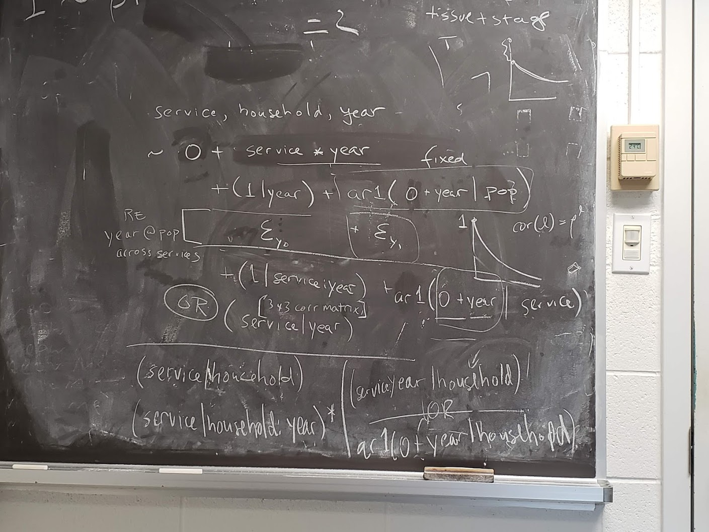

	
Some scribbles on the issues of simulating & fitting complex models to Steve Cygu's WASH data.



- The three predictor variables are service, household, and year
  - household is unambiguously a categorical/random effect/grouping variable.
  - year is by default a continuous variable (i.e., something like `~year` will be treated as a linear trend by R), but is automatically treated as a categorical variable by `lme4` when it appears in a grouping-variable context (i.e., on the right side of a `(f|g)` specification). I don't remember offhand whether `glmmTMB` makes this assumption as well.
  - service is a fixed effect at the population level, but interactions of service with household or year might be treated as random effects
  
  
## some data to test with

```{r}
n_y <- 3
start_year <- 1
dd <- expand.grid(service=c("water","sewage","other"),
                  household=factor(1:3),
                  year=start_year + (0:(n_y-1)))
```

## population-level terms

### basic fixed-effect model

The base model is `~ 0 + service+service:year`, i.e., no overall intercept, because we probably don't want to parameterize an intercept or trend that applies to all three services: this is a no-brainer when we have a multivariate model with different responses measured in different units, but might be a reasonable alternative in this case (in which case we would just use `~service*year`)

Check that we get the parameterization we want:

```{r cn1}
colnames(model.matrix(~0+service+service:year, dd))
```

This assumes we do want to allow for a trend in time. This could be expanded (e.g. a polynomial or spline function of year), or potentially left out (see next section).

### random effects of year

Adding `(1|year)` to the model will allow for iid population-level year-to-year variation around whatever continuous trend in time was assumed above.

To add autoregressive terms at the level of the whole population, we have to make up a dummy categorical variable with a *single level* (e.g. `dd$pop = factor(1)`). This seems crazy but is not, at least for *structured* variation (e.g. see Dormann et al. paper on modeling spatial autocorrelation, which uses a similar trick). Then `ar1(0+year|pop)` represents a single observation of a length-`n_y` multivariate Normal deviate; it's at least theoretically identifiable as long as the number of parameters in the covariance matrix is less than `n_y-1` (or something like that? maybe `n_y-2`?)

More complex ARMA models would be possible (but not really implemented anywhere that I know of), but maybe not practical.

The model `(1|year)` + `ar1(0+year|pop)` gives an autoregressive model where there is an instantaneous drop in correlation after lag-0, i.e. $\textrm{corr}(t) = (1-g) \rho^t$ for $t>0$ (where $g$ is the "nugget effect", i.e. scaled variance of the iid component).

```{r acf1,echo=FALSE}
rho <- 0.8
nugget <- 0.4
tvec <- 0:10
corr <- ifelse(tvec==0,1,(1-nugget)*rho^tvec)
par(las=1,bty="l")
plot(tvec,corr,type="h",xlab="lag",ylab="autocorrelation",
     main=c("rho=0.8, nugget=0.4"))
points(tvec,corr)
```

### temporal variation in services

Beyond the possible time trends in services, we can allow for noise in these at the population level.

- in conjunction with the `(1|year)` term, `(1|service:year)` fits a *positive compound symmetric* model, i.e. it allows a single iid Normal deviate for each service-year combination.
- if we instead specify `(service|year)` we'll get a multivariate-Normal deviate per year with one element per service, also estimating among-service correlations
- if we want to add autoregressive variation in service provision, we would add `ar1(0+year|service)` to the model. This simulates *independent* AR1 series for each service, i.e. $\eta_{ys} = \bar \eta_{ys} + \rho a_{y-1,s} + \epsilon_{y,s}$ (where $\bar \eta_{ys}$ is the fixed-effect mean or trend/expected value for service $s$ in year $y$)
- to *simulate* correlated autoregressive variation in service provision we would define this model (LaTeX not working yet!)

\[
\begin{split}
\boldsymbol \eta_{y} & =  \bar {\boldsymbol \eta}_y + \rho \boldsymbol a_{y-1} + \boldsymbol \epsilon_y \\
\boldsymbol \epsilon_y  & \sim \textrm{MVN}(0,\Sigma)
\end{split}
\]

... but how would we code this in \code{lme4}/\code{brms} etc.?
(This assumes that all three services are *equally* autocorrelated; perhaps we could make $\rho$ a vector and do elementwise multiplication?)

## household-level effects

- `(service|household)`: correlated, time-independent variation among households
- `(service|household:year)`: positive compound-symmetric variation among services across years
- `(0+service:year|household)` correlated random-slopes models per household
- `ar1(0+year|household)`: AR1 variation per household affecting *all* services
